# Box head game
> Group number: 106   
> Group members: Jin Yushang (3035855064), Lu Haoze (3035951519)

## Description of the game:
The Box head game is a fast paced zombie shooting game in which the player act as the main character whose aim is to shoot as much zombies as possible(getting more points) before the main character dies. The number of zombies is changing(probably increasing) as the game proceeds, all the zombies are trying to get closer to the main character.

Rules and actions:
The player has to use keyboard to control the movement and action of the main character. The movements includes the regular up, down, left and right, the actions include shooting with a gun and using a bomb. The player should control the main character to move away from the approaching zombies while killing the zombies by using shooting or bomb, because the main character will die if approached by the zombies and points will be accumulated for being able to kill the zombies.

Features planning to implement:
1. Controlling the movement of main character(up, down, left and right)
2. Controlling shooting and using bomb action of main character(keyboard)
3. Accumulating marks for the player when killing zombies
4. Making zombies approaching main character
5. Determining whether main character or zombie is killed
6. Control the appearing and number of zombies throughout the game

## Installation
### Install to default location
By default, the binary is installed in directory `$HOME/.local/bin/` and resource folder is `$HOME/.boxhead/`. Note that resource folder is created while installation, user does not need to create it.

To install at default location, execute
```bash
make
make install
```

### Install to customized location
If want to specify install location, execute
```bash
make RESOURCE_DIR=your_resource_folder INSTALL_DIR=your_binary_folder
make install RESOURCE_DIR=your_resource_folder INSTALL_DIR=your_binary_folder
```

Example: if user wants to install the binary under `$HOME/bh_ins_test` and want to install the resource folder as `$HOME/bh_ins_test/hama/`, the user should execute
```bash
make RESOURCE_DIR=$HOME/bh_ins_test/hama INSTALL_DIR=$HOME/bh_ins_test
make install RESOURCE_DIR=$HOME/bh_ins_test/hama INSTALL_DIR=$HOME/bh_ins_test
```
Then the program and resources are installed at following locations:
```
/home/eric/bh_ins_test/
├── boxhead
└── hama
    ├── resource
    │   ├── bullet
    │   │   ├── 9mm.json
    │   │   └── rpg.json
    │   └── map
    │       ├── 0.json
    │       ├── bad_map.json
    │       ├── map_2.json
    │       └── map_3.json
    └── saving
```

### Uninstall from default location
To uninstall, if it is installed in default location, execute
```bash
make uninstall
```

### Uninstall from customized location
If it is installed under user specified location, execute
```bash
make uninstall RESOURCE_DIR=your_resource_folder INSTALL_DIR=your_binary_folder
```

__WARNING: When uninstalling, all files under RESOURCE_DIR will be removed. Please type correct path if you use customized location, and backup your savings and resources.__

## Usage
### Start the game
Start the game by executing `INSTALL_DIR/boxhead` or `boxhead` if `INSTALL_DIR` is in environment variable path. Then the program will check terminal environment and check resources. Output will be given if there are errors or problems.
Terminal with size equal to or larger than 80 line, 24 columns is required.

### Basic operations
Then user can follow the menus. By default `j` is used to go down in menus and `k` is used to go up in menus. This can be configured in config file.
`q` is used to go back in the menus and `Enter` key is used to choose the highlighted item.

Entered the game, user can use keys to move and shoot. By default they are `w s a d` to move,
and `SPACE` to fire. This can also be changed in user config file.

User can also use \` key (the key left to `1`) to build walls, and use number keys (1 - 9) to select weapons.

To pause game, press `p`. Then select what to do in the menu.

### Save, load, and delete saving
In game pause menu, user can select `Save and Exit` to save the game status. In Homepage user can select `Load saving` to select and load savings, and select `Delete saving` to select and delete savings.

### Game Strategy
User can use different weapons to kill zombies. The properties of the weapons can be found in `RESOURCE_DIR/bullet/`.
Be careful that some weapons (e.g. RPG) are dangerous that player is also in damage_obj list (which means you could kill yourself if the bullet exploded near you).

Zombies will run after the user. If zombie contacts the user, the zombie will bite the user at a certain rate. Each bite will minus 10 points from player's HP.

Score is counted by both the time you lived for, and the number of zombies you killed.

Permanent walls (the walls coded in map files) will never be destroyed, while walls built by player can be destroyed by player with certain weapons. 

Player and zombies cannot go through walls, and some bullets (bullets with wall in their trig_obj list) cannot go through walls. Some bullets (bullets without wall in their trig_obj list) can fly over walls.   

### Screenshots 
homepage
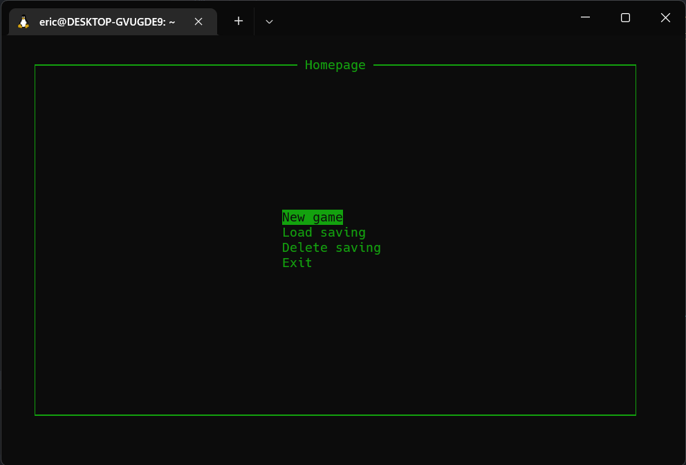

select map
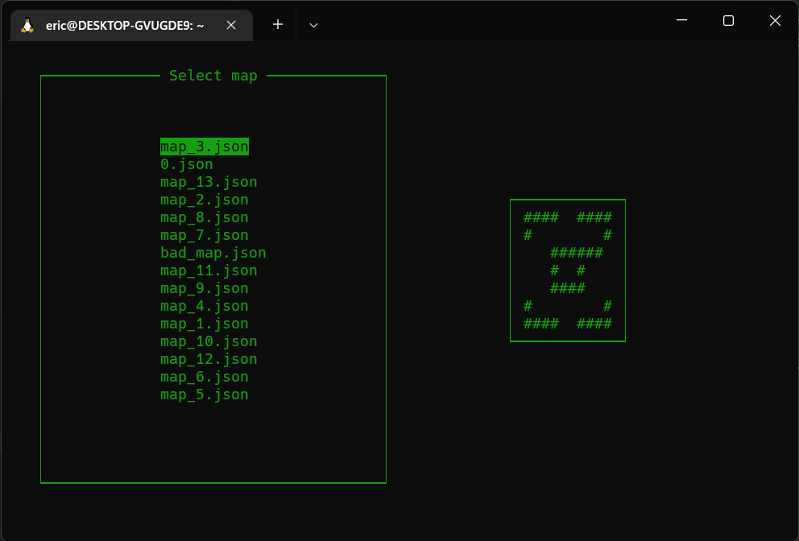

select difficulty
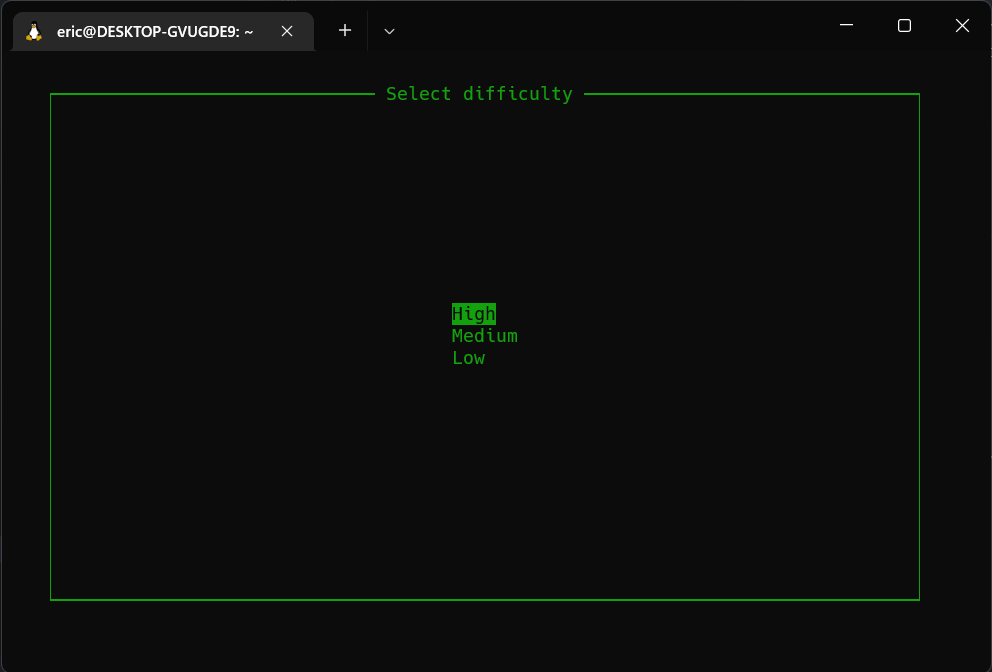

play the game
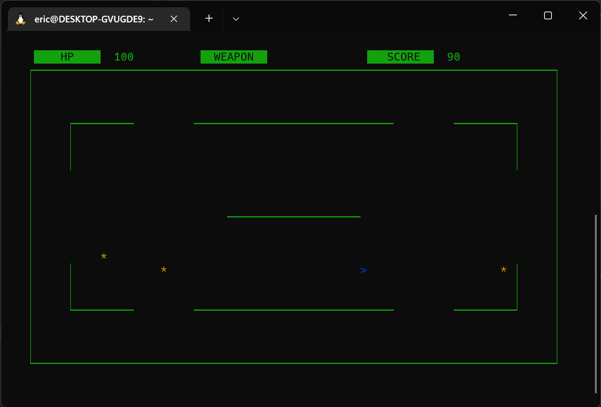

shoot bullets (the white `*`s are bullets)
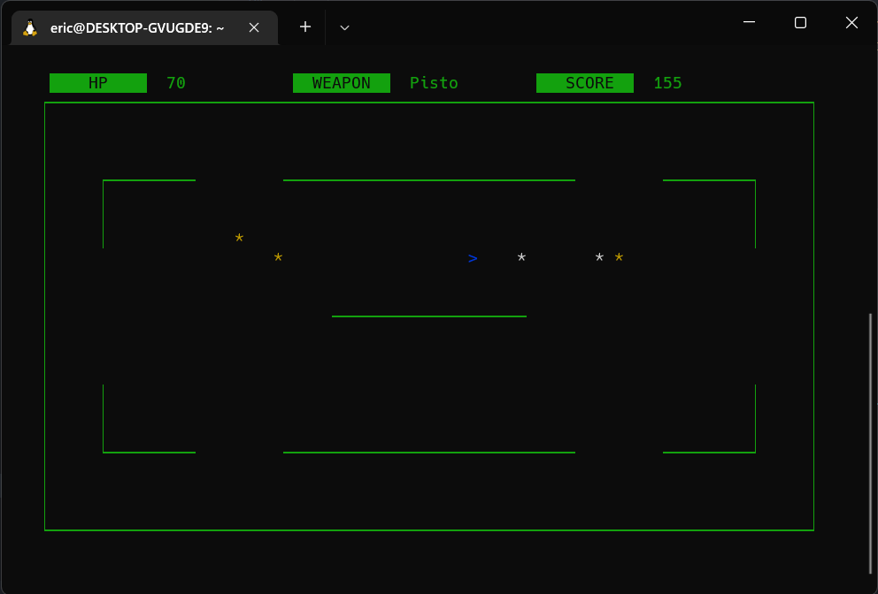

game paused
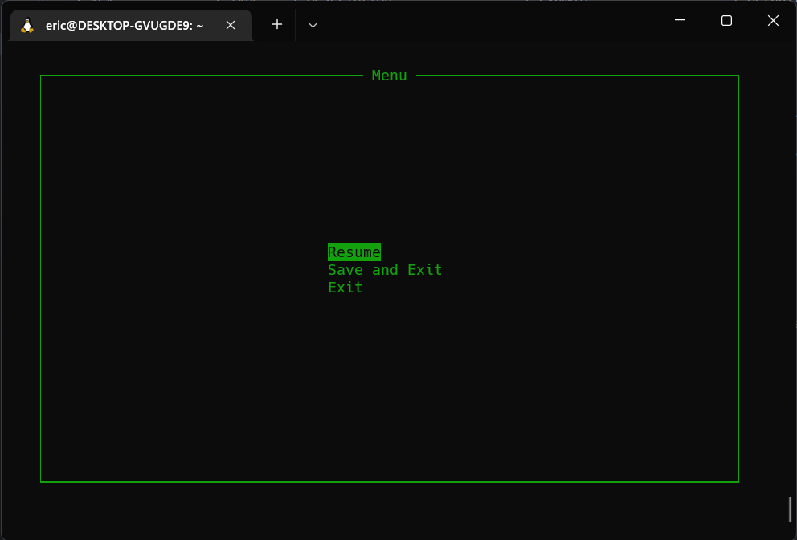

eaten by zombie
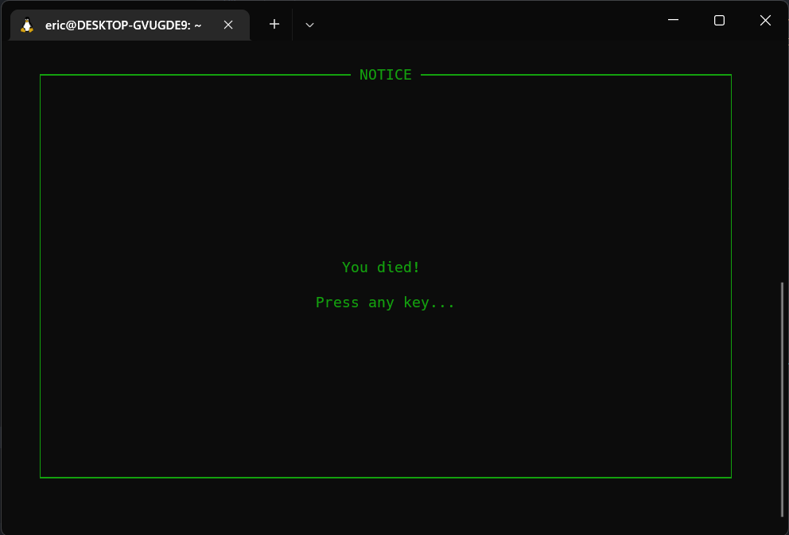

save game status
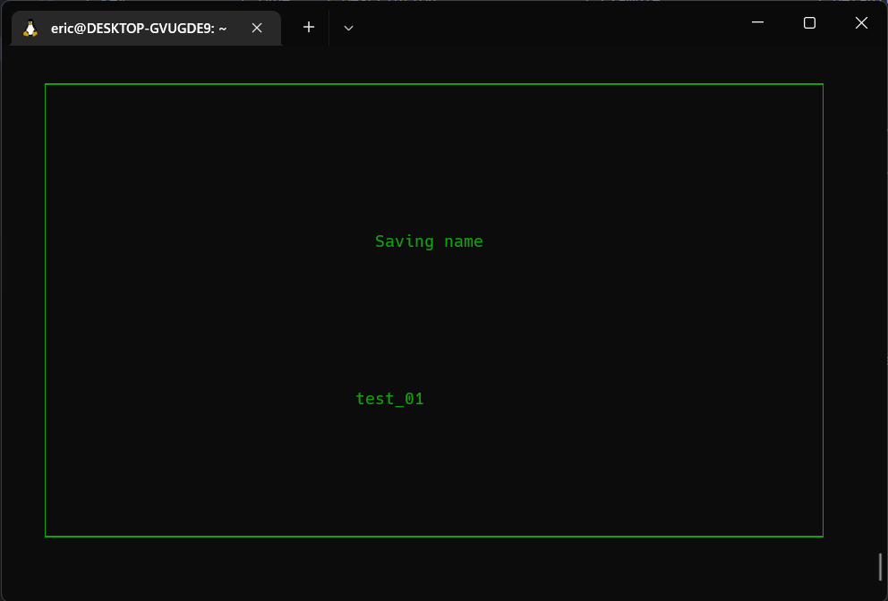

select saving to load
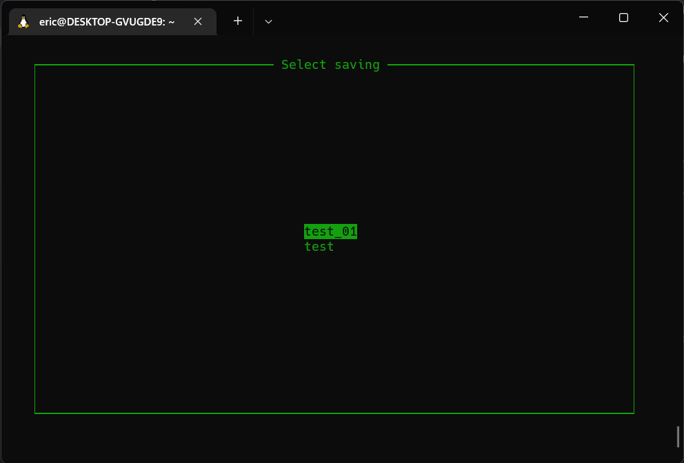

select saving to delete
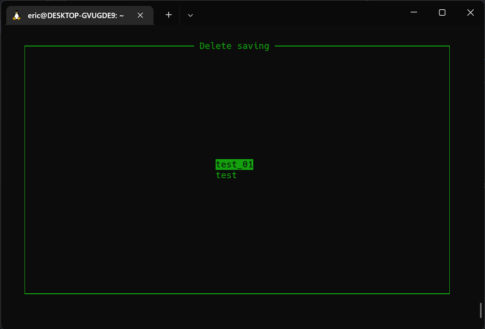
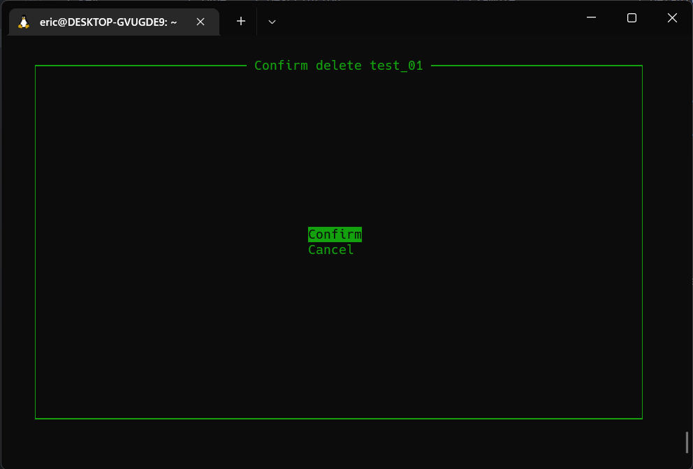
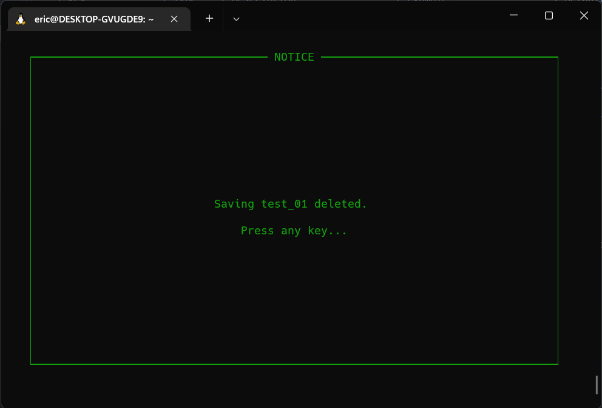

## User configure file
User can configure config file under RESOURCE_DIR. Its name is `init.bh` and is in JSON format.

Following are the keys can be added to configure file
| Key             | Type                 | Description                                                 | Example                  | Default value                                                               |
| --------------- | -------------------- | ----------------------------------------------------------- | ------------------------ | --------------------------------------------------------------------------- |
| theme           | string               | dark or light, bord or thin. separate with a comma or space | "dark, bord"             | "dark, thin"                                                                |
| resource_path   | string               | directory of resource                                       | "/home/eric/hama/"       | RESOURCE_DIR/resource/                                                      |
| saving_path     | string               | directory of savings                                        | "/home/eric/mysavings/"  | RESOURCE_DIR/saving/                                                        |
| clock_frequency | integer              | Frequency of the game loop                                  | 8                        | 12                                                                          |
| player_keyset   | map<string, integer> | Keycodes to move, shoot                                     | {"up": 107, "down": 106} | {"up": 119, "down": 115, "left": 97, "right": 100, "stop": 101, "fire": 32} |
| ui_keyset       | map<string, integer> | Keycodes to move in the menu                                | {"up": 119, "down": 115} | {"up": 107, "down": 106, "enter": 10, "quit": 113}                          |

For the two key sets, user can also specify part of the keys instead of all. (unspecified keys will follow the default) 

A full Example of user configure file:
```json
{
    "theme": "light, bord",
    "resource_path": "/home/eric/hama/",
    "saving_path": "/home/eric/mysavings",
    "clock_frequency": 8,
    "player_keyset": {
        "fire": 122
    },
    "ui_keyset": {
        "enter": 111,
        "quit": 112
    }
}
```

Screenshot of theme ("light, bord")
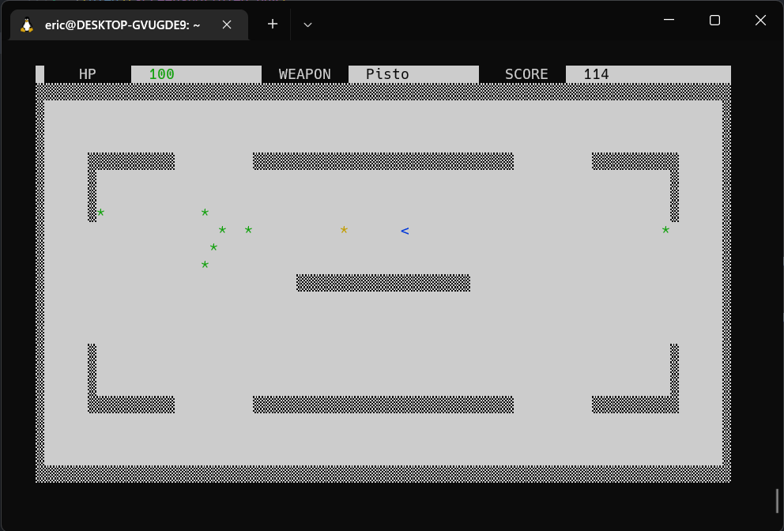

---
For any inquiries about this game, please email [jyseric@connect.hku.hk](jyseric@connect.hku.hk). 